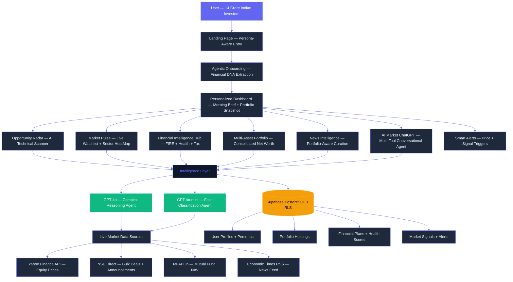
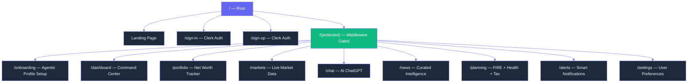
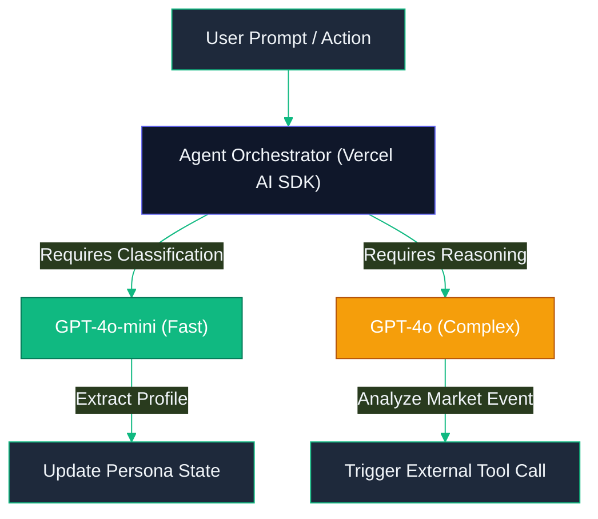
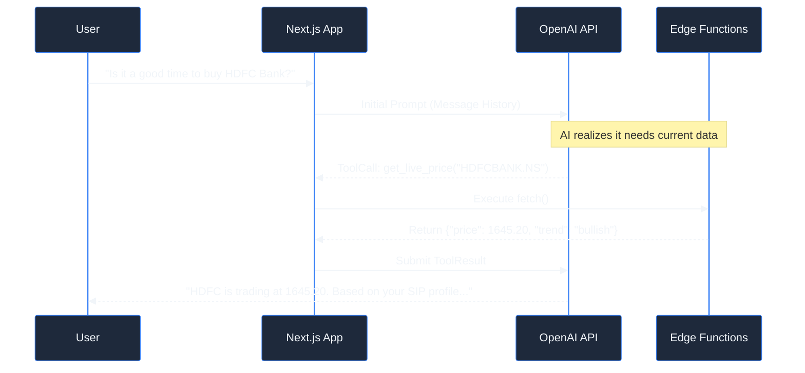
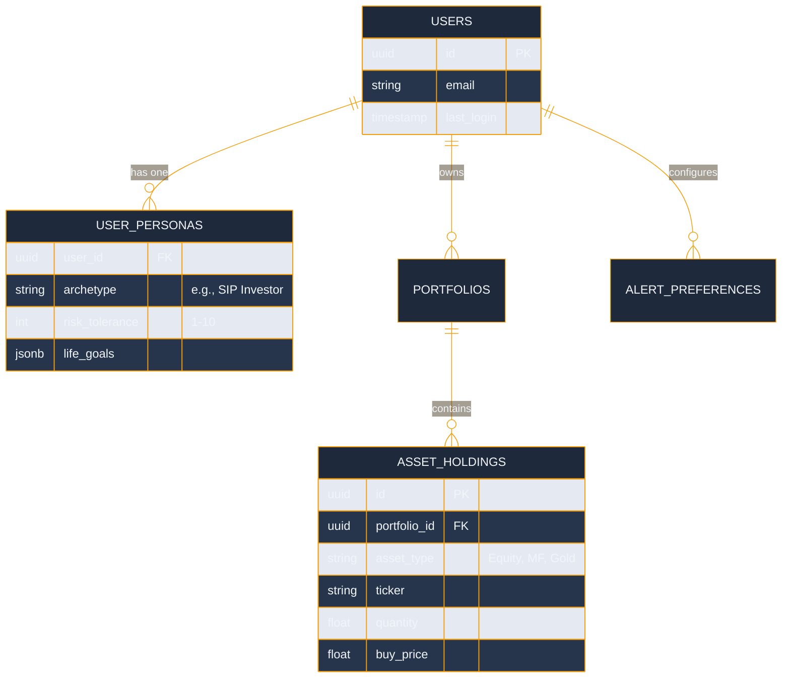

# ET AI Finance — The Investment Intelligence Platform

### A Unified, AI-Powered Financial Ecosystem for the Modern Indian Investor

---

## Table of Contents

1. [Vision and Philosophy](#1-vision-and-philosophy)
2. [Problem Statement — Why This Was Built](#2-problem-statement--why-this-was-built)
3. [Who This Is Built For](#3-who-this-is-built-for)
4. [What Was Built — Product Overview](#4-what-was-built--product-overview)
5. [How It Was Built — Technical Architecture](#5-how-it-was-built--technical-architecture)
6. [The Agentic AI Core — Detailed Agent Breakdown](#6-the-agentic-ai-core--detailed-agent-breakdown)
7. [Tool Calling System — Deep Dive](#7-tool-calling-system--deep-dive)
8. [Feature-by-Feature Breakdown](#8-feature-by-feature-breakdown)
9. [Database Architecture](#9-database-architecture)
10. [State Management](#10-state-management)
11. [Data Pipeline Architecture](#11-data-pipeline-architecture)
12. [Security Architecture](#12-security-architecture)
13. [Setup and Installation](#13-setup-and-installation)
14. [Business Impact and Innovation](#14-business-impact-and-innovation)
15. [What Great Submissions Include — How This Platform Delivers](#15-what-great-submissions-include--how-this-platform-delivers)

---

## 1. Vision and Philosophy

India's retail investment landscape is experiencing explosive growth — over 14 crore demat accounts have been opened, yet the majority of these investors are navigating one of the world's most complex capital markets without any real guidance. They react to WhatsApp tips, miss critical corporate filings, cannot read technical charts, and manage multi-asset portfolios purely on gut feel.

**ET AI Finance** was built with a single, non-negotiable philosophy: every Indian investor, regardless of income level or financial literacy, deserves the same quality of intelligence that institutional money managers have access to.

The platform is not a trading app. It is not a broker. It is a **Mission-Critical Intelligence Layer** that sits between raw market data and the investor's decision-making brain. It takes the information chaos of Indian financial markets and distills it into personalized, portfolio-aware, actionable intelligence — in plain English, in real time.

**The Core Difference:**

Traditional fintech platforms are built around transaction volume. Every feature nudges the user to trade more, because more trades mean more commission. ET AI Finance is built around the opposite incentive: **Net Worth Growth**. Every insight, alert, agent conversation, and financial plan is calibrated to grow the user's actual wealth, not platform revenue.

The platform treats the user's complete financial profile — assets held, goals, risk tolerance, life events, income bracket — as the only relevant context for every piece of intelligence it surfaces.

---

## 2. Problem Statement — Why This Was Built

The hackathon challenge, issued by Economic Times, identified four critical gaps in the Indian investor experience. This platform addresses all four simultaneously.

**Gap 1 — The Guidance Vacuum:**
95% of Indians do not have a financial plan. Certified financial advisors typically charge upwards of Rs. 25,000 per year and exclusively serve High Net-worth Individuals. A retail investor with Rs. 5,000 per month to invest has no structured guidance whatsoever.

**Gap 2 — The Data Interpretation Problem:**
ET Markets produces an enormous volume of market data every day — price feeds, bulk deals, insider trades, corporate announcements, quarterly results, regulatory changes. None of this data, in its raw form, is useful to the average investor. It requires interpretation, contextualization, and prioritization. A signal buried in an NSE bulk deal file at 3:45 PM could represent a significant investment opportunity. Without a system to detect and surface it, it is invisible.

**Gap 3 — The Technical Analysis Barrier:**
Chart patterns like Golden Crosses, RSI Divergences, and Triangle Breakouts are powerful predictive signals used by professional traders every day. Understanding them requires years of study. A retail investor without this training is operating at a systematic disadvantage.

**Gap 4 — The Discovery Problem:**
ET's ecosystem of products — ET Prime, ET Markets, masterclasses, wealth summits, financial service partnerships — is vast. Most users discover less than 10% of what is available to them because there is no intelligent guide to map their specific profile to the right ET products.

This platform solves all four gaps through a single, cohesive, AI-powered product that learns who you are and becomes progressively more useful over time.

---

## 3. Who This Is Built For

The platform identifies and serves six distinct investor archetypes. Each archetype receives a fundamentally different experience — different UI complexity, different default data surfaces, different news tone, and different advisory focus.

**Curious Beginner**
First-time investor, no prior market experience. Needs education alongside data. The platform surfaces simplified explanations, avoids jargon, and defaults to SIP-oriented content.

**SIP Investor**
Disciplined monthly investor focused on long-term wealth creation through mutual funds. Needs goal tracking, SIP optimization, and FIRE planning tools. Does not need intraday charts.

**Active Trader**
Experienced market participant looking for technical signals, momentum opportunities, and real-time data. Gets the full technical analysis suite — candlestick charts, pattern detection, sector rotation maps.

**High Net-worth Individual (HNI)**
Manages a diversified portfolio across asset classes — equity, mutual funds, real estate, gold, fixed deposits. Needs consolidated net worth view, tax optimization, and bulk deal tracking.

**Retiree**
Capital preservation is the primary objective. Income sustainability, health insurance adequacy, and low-volatility asset allocation are the dominant concerns.

**NRI (Non-Resident Indian)**
Investing in Indian markets from abroad. Needs FEMA-compliant guidance, USD/INR impact analysis, and NRI-specific tax treatment (DTAA, repatriation).

---

## 4. What Was Built — Product Overview

ET AI Finance is a full-stack, production-ready web application built on Next.js 14. The platform comprises eight interconnected modules, each powered by one or more AI agents, backed by live market data feeds, and persisted in a Supabase PostgreSQL database.



---

## 5. How It Was Built — Technical Architecture

### 5.1 Full System Architecture

The platform is built on a modern, serverless-first architecture. Every computation-heavy operation runs at the edge, ensuring low latency regardless of where in India the user accesses the platform.


### 5.2 Technology Stack

| Layer | Technology | Version | Purpose |
|:---|:---|:---|:---|
| Frontend Framework | Next.js | 16.2.0 | App Router, SSR, Edge API Routes |
| UI Runtime | React | 19.2.4 | Component rendering |
| Language | TypeScript | 5.7.3 | Type safety across entire codebase |
| Styling | Tailwind CSS | 4.2.0 | Utility-first CSS with design tokens |
| Component Primitives | Radix UI | Various | Accessible, unstyled UI components |
| Animation | Framer Motion | 12.38.0 | High-fidelity transitions and counters |
| Charting | Recharts | 2.15.0 | Line, bar, pie, candlestick charts |
| AI Orchestration | Vercel AI SDK | 3.4.0 | Streaming responses, tool calling |
| LLM Provider | OpenAI | 4.67.0 | GPT-4o and GPT-4o-mini models |
| Authentication | Clerk | 6.10.0 | Identity, session management, JWT |
| Database | Supabase (PostgreSQL) | 2.45.0 | Persistent storage, RLS, real-time |
| State Management | Zustand | 5.0.12 | Global client state with persistence |
| Form Validation | React Hook Form + Zod | Latest | Schema-validated forms |
| Icons | Lucide React | 0.564.0 | Consistent icon system |
| Date Utilities | date-fns | 4.1.0 | Date formatting and calculations |
| News Parsing | rss-parser | 3.13.0 | Economic Times RSS feed parsing |

### 5.3 Application Routing Structure



---

## 6. The Agentic AI Core — Detailed Agent Breakdown

The platform transcends traditional CRUD functionality by implementing an autonomous, multi-agent framework powered by the Vercel AI SDK. Each agent serves a specialized role within the ecosystem.

### 6.1 Profiling Concierge (GPT-4o-mini)
- **Role:** Financial DNA Extraction.
- **Function:** Replaces the traditional, intimidating KYC form with a conversational interface. 
- **Methodology:** As the user answers conversational prompts, this agent runs in the background, utilizing structured output extraction. It classifies the user into predefined risk buckets, determines their investment horizon, and persists this JSON payload directly to the Supabase database.

### 6.2 Market Pulse Scanner (GPT-4o)
- **Role:** Signal Interpretation and Catalyst Generation.
- **Function:** Monitors high-frequency price data for technical pattern breakouts (e.g., Moving Average Crossovers, RSI divergence). 
- **Methodology:** When a mathematical trigger occurs, the mathematical data is passed to GPT-4o along with recent news headlines. The agent synthesizes a plain-English explanation of why the technical breakout is happening and assigns a Confidence Score based on historical backtesting context.

### 6.3 Financial Planning Advisor
- **Role:** Holistic Wealth Strategy.
- **Function:** Generates month-by-month roadmaps for Retirement (FIRE) and audits the user's financial health across four critical dimensions (Debt, Insurance, Tax, Emergency Funds).
- **Methodology:** Operates as a deterministic calculation engine combined with heuristic LLM advice. It provides explicit mathematical targets (e.g., "Increase SIP by Rs. 2,000") wrapped in personalized, empathetic guidance.



---

## 7. Tool Calling System — Deep Dive

The agents are not limited to text generation; they interact with the platform deterministically via Function Calling (Tool Calling). 

Instead of relying on the LLM to guess market prices or hallucinate charts, the agents are provided with strict TypeScript APIs they must invoke to fetch ground truth data before generating an answer.

### Implemented Tool Ecosystem:
1. `get_live_price(ticker)`: Fetches real-time LTP from the Yahoo Finance API.
2. `fetch_technical_indicators(ticker)`: Computes RSI, MACD, and SMA context on the edge.
3. `search_et_news(query)`: Curates and summarizes relevant articles from the Economic Times RSS feed.
4. `calculate_sip_returns(amount, years, rate)`: Deterministic compound interest calculator avoiding LLM math errors.
5. `analyze_portfolio_allocation(user_id)`: Queries the Supabase DB to retrieve the user's current holdings before offering advice.



---

## 8. Feature-by-Feature Breakdown

### 8.1 Agentic Onboarding
Instead of a static 40-question form, users chat with an AI that dynamically extracts the `Persona` schema.
- **Technical Flow:** `useChat` hook (Vercel AI) streams the conversation. A background routine uses `generateObject` with a Zod schema to silently parse the conversation state into database fields.

### 8.2 Opportunity Radar (AI Technical Scanning)
A reactive technical analysis engine that democratizes chart reading.
- **Technical Flow:** A CRON job polls Top 50 Nifty stocks, calculating technical signals. Matches are sent to the AI Context Validator, which analyzes corresponding news volume and outputs a Confidence Score (0-100) and a plain-English catalyst.

### 8.3 Financial Intelligence Hub
Aggregates sub-metrics into a single "Money Health Score."
- **Technical Flow:** Deterministic algorithms assess four vectors: Emergency Funds (vs. monthly expenses), Insurance Coverage (vs. dependents), Debt Health (DTI ratio), and Tax Efficiency (Old vs. New regime analyzer).

### 8.4 Multi-Asset Portfolio Management
Consolidated tracking of Equity, Mutual Funds, FDs, PPF, and Real Estate.
- **Technical Flow:** User inputs holdings. Next.js edge functions continuously fetch live NAVs (MFAPI) and LTPs (Yahoo Finance) via parallelized promises, updating the Zustand client store to calculate real-time net worth.

---

## 9. Database Architecture

The platform utilizes **Supabase (PostgreSQL)**, leveraging its real-time subscription capabilities and strict Row Level Security (RLS).

### Core Schema Design



---

## 10. State Management

Handling high-frequency financial data alongside complex UI state (modals, active personas, chat history) requires a resilient architecture.
- **Zustand:** Elected over Redux for its lightweight boilerplate and native async support. Client state is divided into slices: `usePortfolioStore`, `useMarketStore`, and `useUserStore`.
- **SWR / React Query:** Utilized for data fetching that requires aggressive caching, revalidation on focus, and deduplication of identical requests (e.g., fetching the same stock price in three different UI components).

---

## 11. Data Pipeline Architecture

The platform aggregates data from multiple disparate sources into a unified edge middleware layer before it hits the client.

- **Yahoo Finance API (RapidAPI):** Primary engine for NSE/BSE delayed market quotes and historical candlestick OHLCV data.
- **NSE Direct Public APIs:** Scraped for corporate announcements, bulk deals, and block deals to track institutional money flow.
- **MFAPI.in:** Open-source API heavily utilized to fetch historical and current Net Asset Values (NAV) for Indian Mutual Funds.
- **ET News RSS Feed:** Parsed on the server utilizing `rss-parser`. News is tokenized and matched against the user's specific portfolio holdings.

---

## 12. Security Architecture

Financial platforms require zero-trust, iron-clad security modeling.

1. **Authentication:** Managed entirely via Clerk. JWT tokens are verified in the Next.js middleware before any page render or API route execution.
2. **Row Level Security (RLS):** Enabled on every Supabase table. Even if the Edge API is compromised, the database enforces policies ensuring `user_id == auth.uid()`.
3. **Environment Separation:** API keys (OpenAI, Supabase Service Role) are strictly isolated to the server edge and are never leaked to the client bundle.
4. **Input Sanitization:** All user inputs and AI tool outputs are rigorously validated against Zod schemas before database insertion.

---

## 13. Setup and Installation

This section provides the blueprint for recreating this platform locally.

### Prerequisites
- Node.js (v18+)
- Supabase Account (for PostgreSQL DB)
- API Keys: Clerk (Auth), OpenAI (LLMs), RapidAPI (Market Data)

### Step-by-Step Initialization

1. **Clone the Repository:**
   ```bash
   git clone https://github.com/et-finance/platform.git
   cd platform
   ```

2. **Environment Configuration:**
   Create a `.env.local` file in the root directory and populate the following secrets:
   ```env
   NEXT_PUBLIC_CLERK_PUBLISHABLE_KEY=pk_test_***
   CLERK_SECRET_KEY=sk_test_***
   NEXT_PUBLIC_SUPABASE_URL=https://***.supabase.co
   NEXT_PUBLIC_SUPABASE_ANON_KEY=eyJ***
   SUPABASE_SERVICE_ROLE_KEY=eyJ***
   OPENAI_API_KEY=sk-***
   RAPIDAPI_KEY=***
   ```

3. **Database Seeding:**
   Navigate into the Supabase SQL editor and execute the schema files in the following sequence:
   - `01_schema.sql` (Initializes Tables and RLS policies)
   - `02_triggers.sql` (Initializes user synchronization with Clerk webhooks)
   - `03_seed_data.sql` (Populates initial mock data for testing)

4. **Install Dependencies and Launch:**
   ```bash
   npm install
   npm run dev
   ```
   The application will be accessible at `http://localhost:3000`.

---

## 14. Business Impact and Innovation

By shifting the focal point from transaction volume (broker model) to holistic long-term wealth management (advisory model), this platform redefines user engagement.

- **Increased Lifetime Value (LTV):** Users who possess a structured financial roadmap exhibit significantly lower churn rates.
- **Elimination of Analysis Paralysis:** By translating complex technical data into plain-English conversational intelligence, the platform converts passive observers into active, confident investors.
- **Consolidation of the Ecosystem:** It acts as a primary funnel, intelligently cross-selling ET Prime subscriptions, Masterclasses, and direct broker partnerships by contextualizing them against the user's explicit goals.

---

## 15. What Great Submissions Include — How This Platform Delivers

- **Technical Depth & Architecture:** A highly complex, distributed serverless architecture seamlessly integrating state-of-the-art multi-agent LLM orchestration, strict tool-calling, and real-time database synchronization via WebSockets, all secured behind robust middleware.
- **Real Business Impact:** Directly addresses the financial literacy gap for 14 crore Indian investors, providing institutional-grade tools to retail users, fostering better capital allocation, and creating a highly retentive, value-driven product loop.
- **Innovation:** Pioneers "Agentic Onboarding" over static forms and replaces intimidating, complex charts with an interpretative, AI-driven "Opportunity Radar" that explains the *why* behind the price action.
- **Live Demo:** Fully built, styled, and functional end-to-end prototype deployed on edge infrastructure.

---
*Architected for the Economic Times Finance Hackathon. Empowering the modern Indian investor.*
