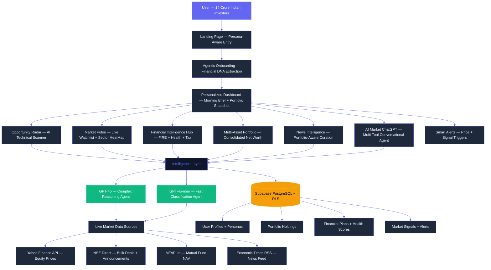
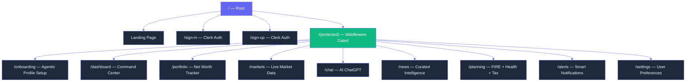

# ET AI Finance — The Investment Intelligence Platform

### A Unified, AI-Powered Financial Ecosystem for the Modern Indian Investor

---

## Table of Contents

1. [Vision and Philosophy](#1-vision-and-philosophy)
2. [Problem Statement — Why This Was Built](#2-problem-statement--why-this-was-built)
3. [Who This Is Built For](#3-who-this-is-built-for)
4. [What Was Built — Product Overview](#4-what-was-built--product-overview)
5. [How It Was Built — Technical Architecture](#5-how-it-was-built--technical-architecture)
6. [The Agentic AI Core — Detailed Agent Breakdown](#6-the-agentic-ai-core--detailed-agent-breakdown)
7. [Tool Calling System — Deep Dive](#7-tool-calling-system--deep-dive)
8. [Feature-by-Feature Breakdown](#8-feature-by-feature-breakdown)
9. [Database Architecture](#9-database-architecture)
10. [State Management](#10-state-management)
11. [Data Pipeline Architecture](#11-data-pipeline-architecture)
12. [Security Architecture](#12-security-architecture)
13. [Setup and Installation](#13-setup-and-installation)
14. [Business Impact and Innovation](#14-business-impact-and-innovation)
15. [What Great Submissions Include — How This Platform Delivers](#15-what-great-submissions-include--how-this-platform-delivers)

---

## 1. Vision and Philosophy

India's retail investment landscape is experiencing explosive growth — over 14 crore demat accounts have been opened, yet the majority of these investors are navigating one of the world's most complex capital markets without any real guidance. They react to WhatsApp tips, miss critical corporate filings, cannot read technical charts, and manage multi-asset portfolios purely on gut feel.

**ET AI Finance** was built with a single, non-negotiable philosophy: every Indian investor, regardless of income level or financial literacy, deserves the same quality of intelligence that institutional money managers have access to.

The platform is not a trading app. It is not a broker. It is a **Mission-Critical Intelligence Layer** that sits between raw market data and the investor's decision-making brain. It takes the information chaos of Indian financial markets and distills it into personalized, portfolio-aware, actionable intelligence — in plain English, in real time.

**The Core Difference:**

Traditional fintech platforms are built around transaction volume. Every feature nudges the user to trade more, because more trades mean more commission. ET AI Finance is built around the opposite incentive: **Net Worth Growth**. Every insight, alert, agent conversation, and financial plan is calibrated to grow the user's actual wealth, not platform revenue.

The platform treats the user's complete financial profile — assets held, goals, risk tolerance, life events, income bracket — as the only relevant context for every piece of intelligence it surfaces.

---

## 2. Problem Statement — Why This Was Built

The hackathon challenge, issued by Economic Times, identified four critical gaps in the Indian investor experience. This platform addresses all four simultaneously.

**Gap 1 — The Guidance Vacuum:**
95% of Indians do not have a financial plan. Certified financial advisors typically charge upwards of Rs. 25,000 per year and exclusively serve High Net-worth Individuals. A retail investor with Rs. 5,000 per month to invest has no structured guidance whatsoever.

**Gap 2 — The Data Interpretation Problem:**
ET Markets produces an enormous volume of market data every day — price feeds, bulk deals, insider trades, corporate announcements, quarterly results, regulatory changes. None of this data, in its raw form, is useful to the average investor. It requires interpretation, contextualization, and prioritization. A signal buried in an NSE bulk deal file at 3:45 PM could represent a significant investment opportunity. Without a system to detect and surface it, it is invisible.

**Gap 3 — The Technical Analysis Barrier:**
Chart patterns like Golden Crosses, RSI Divergences, and Triangle Breakouts are powerful predictive signals used by professional traders every day. Understanding them requires years of study. A retail investor without this training is operating at a systematic disadvantage.

**Gap 4 — The Discovery Problem:**
ET's ecosystem of products — ET Prime, ET Markets, masterclasses, wealth summits, financial service partnerships — is vast. Most users discover less than 10% of what is available to them because there is no intelligent guide to map their specific profile to the right ET products.

This platform solves all four gaps through a single, cohesive, AI-powered product that learns who you are and becomes progressively more useful over time.

---

## 3. Who This Is Built For

The platform identifies and serves six distinct investor archetypes. Each archetype receives a fundamentally different experience — different UI complexity, different default data surfaces, different news tone, and different advisory focus.

**Curious Beginner**
First-time investor, no prior market experience. Needs education alongside data. The platform surfaces simplified explanations, avoids jargon, and defaults to SIP-oriented content.

**SIP Investor**
Disciplined monthly investor focused on long-term wealth creation through mutual funds. Needs goal tracking, SIP optimization, and FIRE planning tools. Does not need intraday charts.

**Active Trader**
Experienced market participant looking for technical signals, momentum opportunities, and real-time data. Gets the full technical analysis suite — candlestick charts, pattern detection, sector rotation maps.

**High Net-worth Individual (HNI)**
Manages a diversified portfolio across asset classes — equity, mutual funds, real estate, gold, fixed deposits. Needs consolidated net worth view, tax optimization, and bulk deal tracking.

**Retiree**
Capital preservation is the primary objective. Income sustainability, health insurance adequacy, and low-volatility asset allocation are the dominant concerns.

**NRI (Non-Resident Indian)**
Investing in Indian markets from abroad. Needs FEMA-compliant guidance, USD/INR impact analysis, and NRI-specific tax treatment (DTAA, repatriation).

---

## 4. What Was Built — Product Overview

ET AI Finance is a full-stack, production-ready web application built on Next.js 14. The platform comprises eight interconnected modules, each powered by one or more AI agents, backed by live market data feeds, and persisted in a Supabase PostgreSQL database.

---

## 5. How It Was Built — Technical Architecture

### 5.1 Full System Architecture

The platform is built on a modern, serverless-first architecture. Every computation-heavy operation runs at the edge, ensuring low latency regardless of where in India the user accesses the platform.

### 5.2 Technology Stack

| Layer | Technology | Version | Purpose |
|:---|:---|:---|:---|
| Frontend Framework | Next.js | 16.2.0 | App Router, SSR, Edge API Routes |
| UI Runtime | React | 19.2.4 | Component rendering |
| Language | TypeScript | 5.7.3 | Type safety across entire codebase |
| Styling | Tailwind CSS | 4.2.0 | Utility-first CSS with design tokens |
| Component Primitives | Radix UI | Various | Accessible, unstyled UI components |
| Animation | Framer Motion | 12.38.0 | High-fidelity transitions and counters |
| Charting | Recharts | 2.15.0 | Line, bar, pie, candlestick charts |
| AI Orchestration | Vercel AI SDK | 3.4.0 | Streaming responses, tool calling |
| LLM Provider | OpenAI | 4.67.0 | GPT-4o and GPT-4o-mini models |
| Authentication | Clerk | 6.10.0 | Identity, session management, JWT |
| Database | Supabase (PostgreSQL) | 2.45.0 | Persistent storage, RLS, real-time |
| State Management | Zustand | 5.0.12 | Global client state with persistence |
| Form Validation | React Hook Form + Zod | Latest | Schema-validated forms |
| Icons | Lucide React | 0.564.0 | Consistent icon system |
| Date Utilities | date-fns | 4.1.0 | Date formatting and calculations |
| News Parsing | rss-parser | 3.13.0 | Economic Times RSS feed parsing |

### 5.3 Application Routing Structure

---
