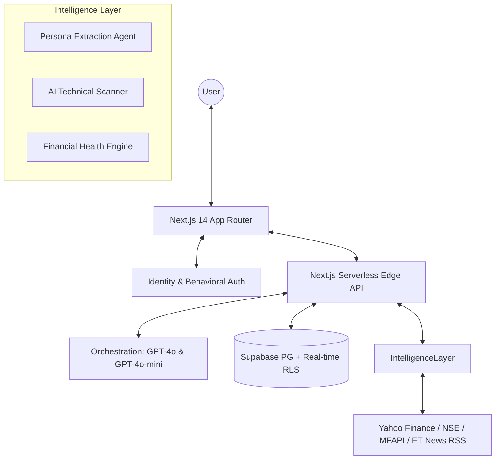

# ET AI Finance: The Investment Intelligence Platform
### *A Unified, AI-Powered Financial Ecosystem for the Modern Indian Investor*

---

## 🌟 Vision & Philosophy
India’s retail investment landscape is exploding, yet most investors are "flying blind" — reacting to news cycles, missing critical technical triggers, and lacking a cohesive financial roadmap. **ET AI Finance** is a **Mission-Critical Intelligence Layer** that bridges the gap between raw market data and actionable wealth-creation decisions.

**Our Core Difference:** 
Unlike traditional platforms that prioritize broker commission through over-trading, we prioritize **Net Worth Growth** through **Portfolio-Aware Intelligence**. Every insight, alert, and advisor session is contextualized by what you already own and what you aim to achieve.

---

## 🏗️ Technical Architecture

### 1. High-Level System Design

### 2. The "Agentic" Core
| Agent | Role | Technical Implementation |
| :--- | :--- | :--- |
| **Profiling Concierge** | Financial DNA Extraction | Uses `gpt-4o-mini` with a structured `PROFILE` schema extraction to bucket users into 6 distinct personas. |
| **Market Pulse Agent** | Signal Interpretation | Monitors live quotes and volume surges to generate plain-English catalysts for technical breakouts. |
| **Planning Advisor** | Holistic Strategy | Generates month-by-month "FIRE" roadmaps and "Money Health" audits across 4 critical dimensions. |
| **News Intelligence** | Selective Curation | Filters the firehose of ET news to surface only what impacts your specific holdings and watchlist. |

---

## 🚀 Feature Ecosystem: In-Depth Breakdown

### 1. Agentic Onboarding & Persona Engine
*   **The Experience:** Replaces 40-field KYC forms with a friendly, sub-2-minute conversation. 
*   **Persona Mapping:** Automatically identifies your archetype (*SIP Investor, Active Trader, HNI, Retiree, etc.*) and pivots the entire platform UI — from chart complexity to news tone — to match your expertise.
*   **Structured Metadata:** Extracts goals (Experience, Horizon, Capacity) and saves them as persistent Supabase profiles for ongoing advisor context.

### 2. Opportunity Radar (AI Technical Scanning)
*   **Pattern Intelligence:** Automated detection of "Golden Cross," "RSI Divergence," and "Triangle Breakouts" on over 50+ Top Indian Stocks.
*   **AI Reasoning & Catalyst:** For every pattern, the AI provides a "Confidence Score" and a "Catalyst" (e.g., "Heavy institutional accumulation detected").
*   **Confidence Circle:** A visual 0-100 score indicating the statistical reliability of the detected technical setup based on historical backtesting.
*   **Interactive Price Map:** Visualizes AI-generated **Target Price** and **Stop Loss** levels directly on the interface.

### 3. Financial Intelligence Hub (Planning & Health)
*   **Money Health Score:** A 0-100 diagnostic across **Emergency Fund**, **Insurance Coverage**, **Debt Health**, and **Tax Efficiency**.
*   **FIRE Roadmap:** A robust retirement simulation that calculates your **Target Corpus** and identifies the exact year inclusive of inflation and incremental SIP growth.
*   **Life Event Advisor:** Specialized action plans for major milestones like "Home Purchase," "Wedding," "Education," or "Child Birth" with dedicated strategic to-do lists.
*   **Tax Optimization Wizard:** Interactive comparison between Old vs. New Tax Regimes to determine the most efficient compliance path for your income level.

### 4. Market Pulse & Watchlist
*   **Unified Watchlist:** Add any NSE stock with one tap. Real-time price polling (2s frequency) keeps your eyes on the move.
*   **Sector Heat Map:** A hierarchical treemap visualizing sector-wide strength (Banking, IT, FMCG, etc.) and deep-dive stock rankings within each sector.
*   **Institutional Intelligence:** Tracks **Bulk & Block Deals** in real-time, highlighting where the "Smart Money" is flowing today.

### 5. Multi-Asset Portfolio Management
*   **Consolidated Net Worth:** Live tracking of Stocks, Mutual Funds, Fixed Deposits, PPF, Gold (SGB/Physical), and Real Estate.
*   **Portfolio Health:** Immediate visual feedback on asset allocation balance vs. your target persona.
*   **Live Valuation:** Equity holdings are valued in real-time using live market feeds, providing an up-to-the-second view of your wealth status.

---

## 🛠️ Technical Stack & Implementation

*   **Frontend Framework:** Next.js 14 (App Router) with strict TypeScript.
*   **UI System:** Vanilla CSS with Radix UI primitives and Tailwind for utility.
*   **Animation:** Framer Motion for high-fidelity transitions (Persona reveal, Health score counters).
*   **Intelligence:** Vercel AI SDK with OpenAI `gpt-4o` (Complex reasoning) and `gpt-4o-mini` (Fast classification).
*   **State Management:** Zustand with LocalStorage persistence for multi-tab synchronization.
*   **Database & API:** Supabase (PostgreSQL) with Real-time subscriptions for Alerts and Row Level Security (RLS).
*   **Live Data Pipeline:** 
    *   **Equity:** Yahoo Finance API (Polled at 2-5s intervals).
    *   **Mutual Funds:** MFAPI.in for NAV data.
    *   **News:** Economic Times RSS feed integration.

---

## 📊 Technical Deep-Dives

### How Signal Intelligence Works
The platform doesn't just show price changes. It runs a background analysis:
1. **Raw Feed:** Fetches OHLCV data from market hooks.
2. **Technicals:** Calculates RSI, MACD, and SMA crossovers.
3. **AI Layer:** GPT-4o parses the technical state + recent news context.
4. **Insight:** Outputs a structured JSON containing a technical explanation, confidence score, and trade levels.

---

## 🚀 Setup & Installation

1.  **Clone:** `git clone https://github.com/et-finance/platform.git`
2.  **Environment:** Create `.env.local` with your `NEXT_PUBLIC_CLERK_PUBLISHABLE_KEY`, `CLERK_SECRET_KEY`, `SUPABASE_URL`, `SUPABASE_SERVICE_ROLE_KEY`, and `OPENAI_API_KEY`.
3.  **Database:** Execute the SQL scripts in order: `schema.sql` (Tables), `triggers.sql` (Automations), `seed.sql` (Demo data).
4.  **Launch:** `npm install && npm run dev`

---

## 🛡️ Reliability & Accuracy
This platform is a prototype built for the ET Finance Hackathon. Financial data is fetched from public APIs and technical analysis is AI-synthesized. Always consult a certified financial advisor before making real-money decisions.

---
**Build for 1.4 Billion. Intelligent for One. ET AI Finance.**
